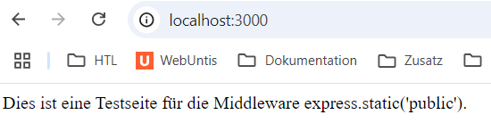
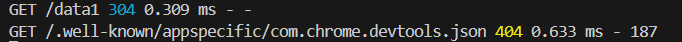

# Protokoll zum Projekt **Express.js**
##### im Rahmen des Faches 5ABI* WMC Klewein 2425 von Jürgen Huber (5ACIF) 
---

## ✅ Grundlegendes  

- Zum Starten des Servers: node index.js  
- Im Browser http://localhost:3000 eingeben und dann das jeweilige Untverzeichnis hinzufügen

---

## 🧩 Middleware

- ✅ **JSON-Body Parser**  
Middleware mit `express.json()` zur Verarbeitung von JSON-Daten in `req.body`

- ✅ **Statische Dateien**  
Middleware mit `express.static('public')` zum Bereitstellen von Dateien aus dem `public`-Ordner (z. B. HTML, CSS, Bilder)  
Screenshot (index.html wird auotmatisch aufgerufen):  


- ✅ **Logging mit Morgan**  
Logging-Middleware für Express. HTTP-Anfragen werden in der Konsole protokolliert.  
Screenshot:  
  
GET → HTTP-Methode  
/data1 → Route  
200 → Statuscode (OK)  
9.095 ms → Antwortzeit  
10 → Größe der Antwort in Bytes  


---

## 🚦 Routing

- 🟢 **GET /data1**  
Gibt den Text **"Hallo Welt"** im Browser aus  
Screenshot:  


- 🟢 **GET /data2**  
Gibt die Inhalte der Datei `fileTest.json` im JSON-Format zurück  
Screenshot:  


- 🟡 **POST /api/data1**  
Empfängt JSON-Daten und gibt eine HTML-Seite als Antwort zurück. Getestet mit Postman.  
Screenshot:  


---

## 🚀 Serverstart

- Mit `app.listen(port, ...)` wird der Server gestartet und hört auf Anfragen unter `http://localhost:3000`

---

## 📁 Projektstruktur

```bash
project_express/
├── index.js
├── fileTest.json
├── README.me
└── public/
    ├── index.html
└── images/
    ├── img_1.png
    ├── img_2.png
    ├── img_3.png
    ├── img_4.png
    ├── img_12.png
