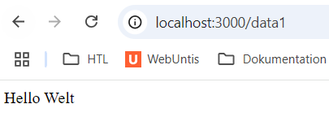
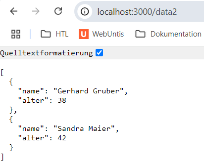
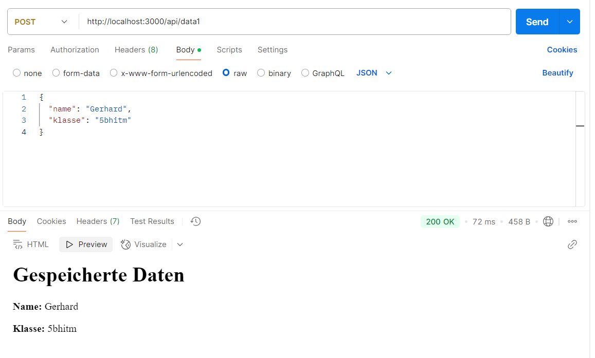

# Protokoll zum Projekt **Express.js**
##### im Rahmen des Faches 5ABI* WMC Klewein 2425 von Jürgen Huber (5ACIF) 
---

### ✅ Eingebaute Funktionen

---

### 🧩 Middleware

- ✅ **JSON-Body Parser**  
  Middleware mit `express.json()` zur Verarbeitung von JSON-Daten in `req.body`

- ✅ **Statische Dateien**  
  Middleware mit `express.static('public')` zum Bereitstellen von Dateien aus dem `public`-Ordner (z. B. HTML, CSS, Bilder)
  

---

### 🚦 Routing

- 🟢 **GET /data1**  
  Gibt den Text **"Hallo Welt"** im Browser aus



- 🟢 **GET /data2**  
  Gibt die Inhalte der Datei `fileTest.json` im JSON-Format zurück
  

- 🟡 **POST /api/data1**  
  Empfängt JSON-Daten und gibt eine HTML-Seite als Antwort zurück
  

---

### 🚀 Serverstart

- Mit `app.listen(port, ...)` wird der Server gestartet und hört auf Anfragen unter z. B. `http://localhost:3000`

---

### 📁 Projektstruktur

```bash
mein-projekt/
├── server.js
├── fileTest.json
└── public/
    ├── index.html
